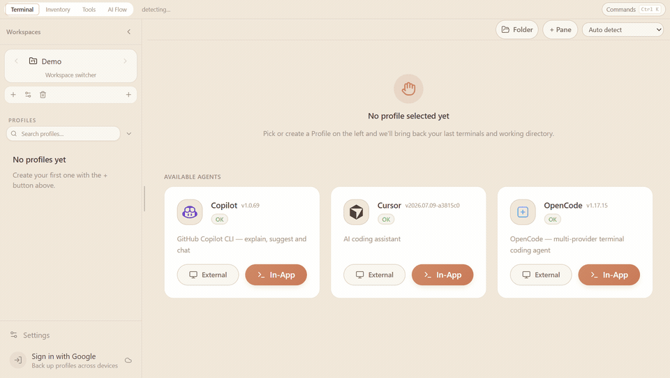
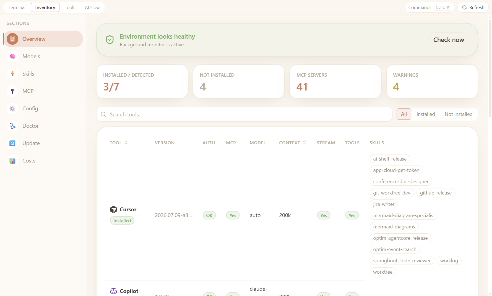

# AI Shelf



> Unified toolkit to inspect, launch, and orchestrate AI CLIs — Claude Code, GitHub Copilot, and Cursor — in one place.

[](LICENSE)

[中文說明](README.zh-TW.md) · [Changelog](CHANGELOG.md)

**v4.1.0** — pnpm monorepo with an Electron desktop app, a lightweight inventory CLI (`ai`), and a terminal profile manager (`ai-shelf`). **Profile** is the shared data model for the desktop app and CLI — see [docs/data-model.md](docs/data-model.md).

---

## What's in the repo

| Deliverable | Binary / entry | Role |
|---|---|---|
| **Inventory CLI** | `ai` | Scan models, skills, MCP, config; run doctor/update/raw |
| **Profile CLI** | `ai-shelf` | Manage profiles, CLI sessions, broadcast exec; TUI |
| **Desktop app** | `pnpm electron` | Terminal · Inventory · Tools · AI Flow (Electron + React) |

The desktop app and `ai-shelf` share one SQLite database. **Profile Groups** split and organize **Profiles** (names, defaults, pane layouts) across both surfaces.

---

## Features

### Inventory (`ai`)

- **Overview** — capability matrix, summary stats, warnings, env-var presence
- **Models** — per-tool model chips with capability columns; long lists expand inline (`+N more`)
- **Skills** — per-tool skill cards + cross-tool skill matrix
- **MCP** — server inventory, sync status, cross-tool matrix, **MCP sync** (copy missing servers across tools)
- **Config** — config / instruction / MCP file paths, clickable to open
- **Doctor** — parallel health checks (binary, auth, config JSON)
- **Update** — version check and one-click update per tool and self
- **JSON output** — `--json` on every inventory command

### Terminal profiles (`ai-shelf`)

- **Profile Groups** — top-level categories used to split profiles
- **Profiles** — named terminal environments (default cwd, tool, accent color, broadcast input) under each profile group; same records as the desktop sidebar
- **CLI sessions** — optional headless PTY sessions scoped to a profile (`Profiles` workspace internally)
- **Broadcast exec** — `profile exec <name> … --broadcast` sends a command to all running CLI sessions in a profile
- **TUI** — profile list + session management (`ai-shelf tui`)
- **Legacy** — `workspace` / `group` / `session` commands remain but are deprecated

### Desktop app (Electron)

- **Four modes** — **Terminal** (default) · **Inventory** · **Tools** · **AI Flow**
- **Terminal** — profiles sidebar, embedded multi-pane xterm.js + node-pty, broadcast input, external launch
- **Inventory** — Overview · Models · Skills · MCP · Config · Doctor · Update · **Usage** (spend / budgets)
- **Tools** — everyday utilities: Codec, Crypto, Time, Cron, Regex, JSON, Markdown, YAML ↔ JSON, JWT, UUID, Diff
- **AI Flow** — author, schedule, and run multi-agent `.flow.md` workflows (templates, chat authoring, run history)
- **Profiles sidebar** — create/rename/delete profiles; each profile stores split-pane layout in SQLite
- **External launch** — Windows Terminal / PowerShell / CMD on Windows; `$SHELL` (bash / zsh / fish / sh) on macOS and Linux
- **Cloud backup** — optional Google sign-in to back up profiles (manual sync; see in-app Account settings)
- **Detached windows** — optional pop-out chat and settings windows
- **Themes** — light / dark / follow system (React + Tailwind CSS v4)

---

## Supported tools

| Tool | Binary | Inventory id |
|---|---|---|
| Claude Code | `claude` | `claude` |
| GitHub Copilot CLI | `copilot` / `gh copilot` | `copilot` |
| Cursor | `agent` | `cursor` |
| OpenAI Codex CLI | `codex` | `codex` |
| Google Gemini CLI | `gemini` | `gemini` |
| Aider | `aider` | `aider` |
| OpenCode | `opencode` | `opencode` |

---

## Desktop app



Switch **Terminal**, **Inventory**, **Tools**, and **AI Flow** from the header. Inventory opens the tabbed dashboard above (including Usage); Terminal is the embedded multi-pane launcher with a profiles sidebar; Tools holds local utilities; AI Flow is the automation console.

→ **[Full page-by-page guide with screenshots](docs/pages.md)** · [繁體中文版](docs/pages.zh-TW.md)

---

## Installation

> **End-user distribution:** Desktop builds for **Windows**, **macOS**, and **Linux** ship on [GitHub Releases](https://github.com/MomentaryChen/ai-shelf/releases). The profile CLI **`ai-shelf`** is on [npm](https://www.npmjs.com/package/ai-shelf). The inventory CLI (`ai`) remains build-from-source only.

### Desktop app (recommended)

Download the asset for your OS from [GitHub Releases](https://github.com/MomentaryChen/ai-shelf/releases):

| Platform | Asset | Notes |
|---|---|---|
| **Windows** | `AI-Shelf-Setup-<version>.exe` | NSIS installer only (not portable). SmartScreen may warn — self-signed; **More info** → **Run anyway**. See [docs/WINDOWS_CODE_SIGNING.md](docs/WINDOWS_CODE_SIGNING.md). |
| **macOS** | `AI-Shelf-<version>-arm64.dmg` or `-x64.dmg` | Unsigned — first launch may need right-click → **Open**, or clear quarantine (`xattr -dr com.apple.quarantine "/Applications/AI Shelf.app"`). |
| **Linux** | `AI-Shelf-<version>.AppImage` | Unsigned — `chmod +x` then run. Static AppImage runtime (no libfuse2). |

The installed app includes Terminal, Inventory, Tools, AI Flow, and embedded terminals. You do **not** need Node.js on the machine.

Step-by-step install, uninstall, and in-app updates: [docs/RELEASE.md](docs/RELEASE.md) (For users). Maintainer release flow is in the same guide.

### Profile CLI — `ai-shelf` (npm)

```bash
npm install -g ai-shelf
ai-shelf profile list
ai-shelf tui
```

Requires Node.js ≥ 22. On the same machine as the desktop app, `ai-shelf` shares the SQLite profile database. For most users, the **desktop installer** alone is enough.

### Inventory CLI — `ai` (from source)

The inventory CLI (`ai`) is **not** published to npm (the unrelated [`ai`](https://www.npmjs.com/package/ai) package on npm is a different project). Use **Inventory** mode in the desktop app, or clone and build below.

### From source (monorepo)

```bash
git clone <repo-url> ai-shelf
cd ai-shelf
pnpm install          # rebuilds native modules (node-pty, better-sqlite3)
pnpm build
pnpm start            # ai inventory / doctor / …
pnpm exec ai-shelf profile list
pnpm electron         # desktop app
```

**Requirements:** Node.js ≥ 22, pnpm ≥ 10

---

## Usage

### Inventory CLI — `ai`

```
ai <command> [subcommand] [options]
```

#### `ai inventory` (alias: `ai inv`)

```bash
ai inventory            # full overview table
ai inventory models     # model + context info
ai inventory skills     # skills per tool
ai inventory mcp        # MCP server list
ai inventory config     # config & instruction file paths
ai inventory claude     # detail view for a single tool
```

**Example output:**

```
  AI Shelf

  TOOL             AUTH   MCP   MODEL                    CTX    STREAM   TOOLS   SKILLS
  ──────────────────────────────────────────────────────────────────────────────────────
  claude           ok     yes   claude-opus-4-5          200k   yes      yes     bash,edit,...
  copilot          ok     yes   gpt-4o                   128k   yes      yes     search,...
  cursor           ok     no    claude-3-5-sonnet         —     yes      yes     —

  MCP Servers: filesystem, github, postgres

  Config Files:
    ~/.claude.json
    ~/.config/gh/config.yml
```

#### `ai doctor`

```bash
ai doctor
ai doctor --json
```

Checks: binary in `PATH`, auth status, config JSON validity, MCP config JSON validity.

#### `ai raw <tool> [args...]`

```bash
ai raw claude --version
ai raw copilot auth status
```

#### `ai update [target]`

```bash
ai update              # all detected tools + self
ai update claude
ai update copilot
ai update cursor
ai update self
```

#### Global options

| Flag | Description |
|---|---|
| `--json` | Output as JSON |
| `-h, --help` | Show help |
| `-v, --version` | Show version |

---

### Profile CLI — `ai-shelf`

Persistent data (Windows):

| Path | Purpose |
|---|---|
| `%APPDATA%/ai-shelf/config.yaml` | App config |
| `%APPDATA%/ai-shelf/workspaces.db` | SQLite database (profiles + layouts) |
| `%APPDATA%/ai-shelf/logs/app.log` | Logs |

See [docs/data-model.md](docs/data-model.md) for how profiles map to storage. [繁體中文版](docs/data-model.zh-TW.md)

```bash
# Profiles (primary — shared with desktop app)
ai-shelf profile list
ai-shelf profile create <name> [--cwd <path>] [--tool <tool>] [--color <hex>]
ai-shelf profile update <profile> [--name] [--cwd] [--tool] [--broadcast|--no-broadcast]
ai-shelf profile delete <profile>
ai-shelf profile reorder <profile...>
ai-shelf profile exec <profile> <command...> [--broadcast] [--session <name>]

# Full-screen TUI
ai-shelf tui

# Legacy (deprecated)
ai-shelf workspace …
ai-shelf group …
ai-shelf session …
```

See [`packages/cli/STRUCTURE.md`](packages/cli/STRUCTURE.md) for package internals.

---

## Development

```bash
pnpm install                 # postinstall rebuilds native addons for Electron

# TypeScript
pnpm dev                     # watch root src/ (inventory + electron main)
pnpm dev:cli                 # watch packages/cli
pnpm dev:renderer            # Vite dev server for React UI

# Build & run
pnpm build                   # CLI package + tsc + Vite renderer
pnpm start                   # node dist/cli.js  →  `ai` commands
pnpm electron                # build + launch desktop app
pnpm electron:dev            # electron without rebuild (after pnpm build)

# Native modules (node-pty for Electron)
pnpm rebuild:native          # current Electron ABI
pnpm rebuild:native:all      # all installed Electron versions

# Quality & packaging
pnpm test:e2e                # Playwright screenshot tests
pnpm gen:docs-assets         # refresh README/docs PNGs + GIFs (en+zh) before release (Windows + ffmpeg)
pnpm lint
pnpm format / pnpm format:check
pnpm package:win             # standalone CLI exe (pkg)
pnpm dist:win                # Windows NSIS installer → release/AI-Shelf-Setup-<version>.exe
pnpm dist:mac                # macOS DMG/ZIP (unsigned; run on macOS) → release/AI-Shelf-<version>-*.dmg
pnpm dist:linux              # Linux AppImage (unsigned; run on Linux) → release/AI-Shelf-<version>.AppImage
pnpm dist:win:portable       # dev-only portable exe (do not ship to users)
```

### Project structure

```
ai-shelf/                 # root workspace (Electron app + inventory CLI)
├── src/
│   ├── cli.ts                    # `ai` entry — inventory, doctor, raw, update
│   ├── commands/                 # CLI command handlers
│   ├── inventory/                # Claude / Copilot / Cursor detectors
│   ├── electron/                 # Main process, preload, workspace-host
│   ├── renderer/                 # React UI (Terminal · Inventory · Tools · Flow)
│   │   ├── components/           # ChatTab, ProfileSidebar, *Tab, …
│   │   ├── hooks/                # useInventoryScan, useProfileWorkspace, …
│   │   └── terminal/             # split-tree, layout serialize, SQLite sync
│   └── utils/
├── packages/cli/                 # `ai-shelf` workspace manager
│   └── src/
│       ├── cli/                  # Commander commands
│       ├── core/                 # ports, entities, errors
│       ├── database/             # SQLite + migrations + repositories
│       ├── services/             # workspace, group, session, profile, exec
│       ├── runtime/              # PTY, process registry, event bus
│       └── tui/                  # neo-blessed terminal UI
├── docs/pages.md                 # Desktop UI walkthrough (EN)
├── docs/pages.zh-TW.md           # Desktop UI walkthrough (zh-TW)
├── tests/e2e/                    # Playwright tests
└── scripts/                      # gen-icon, rebuild-native
```

### Tech stack

| Layer | Stack |
|---|---|
| Inventory CLI | Node.js, native `parseArgs` |
| Profile CLI | Commander, better-sqlite3, node-pty, RxJS, Zod, Pino |
| Desktop | Electron 41, React 19, Vite 8, Tailwind CSS 4, xterm.js |
| Tests | Playwright |

---

## License

MIT
