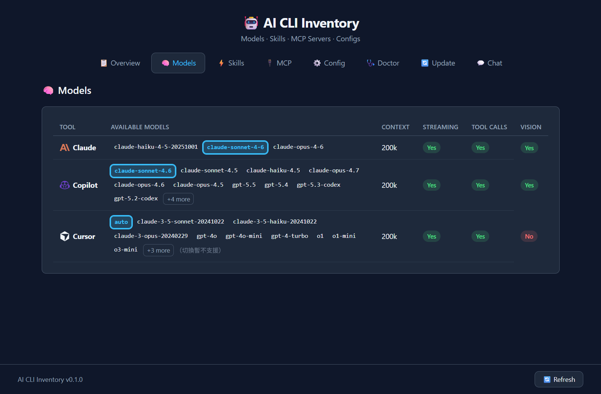
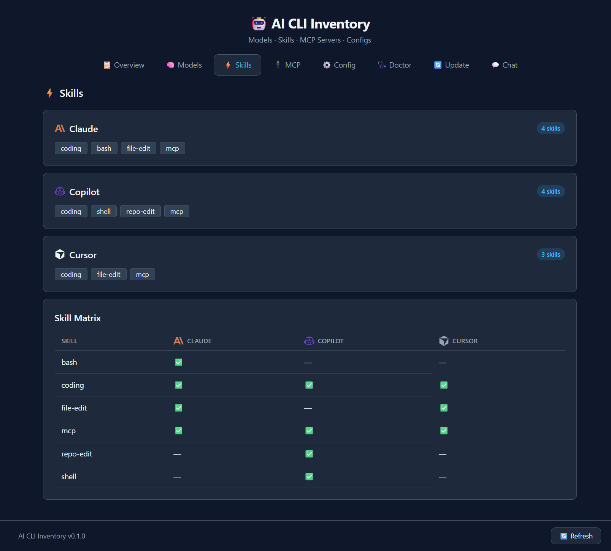
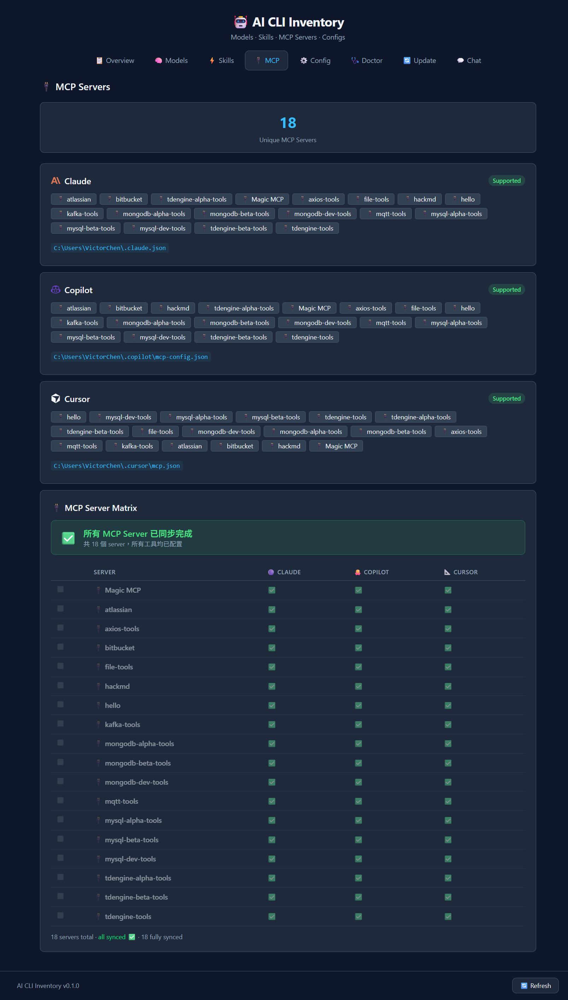
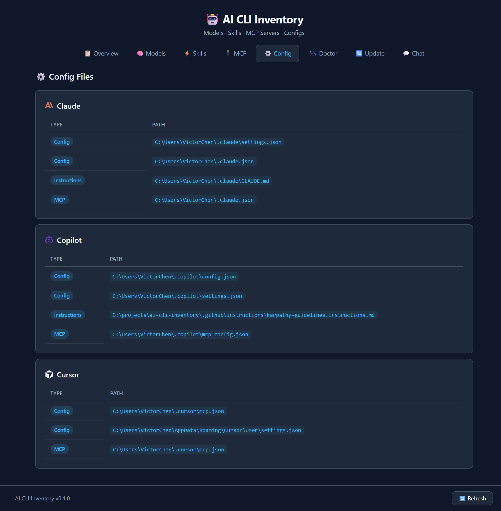
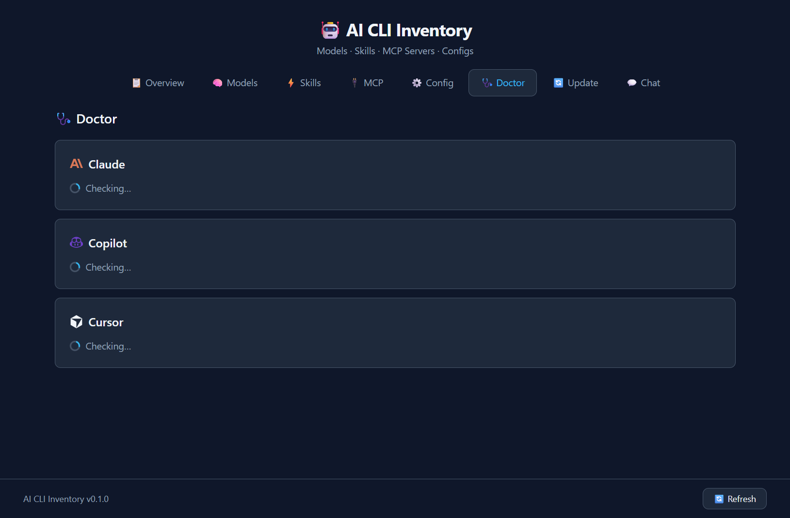
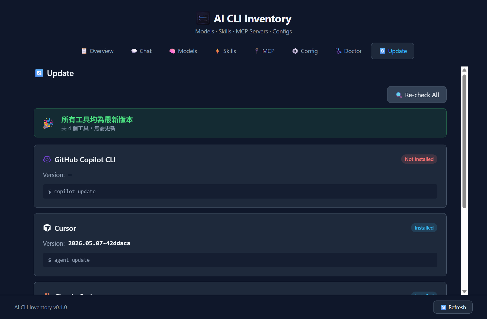

# UI Pages — Detailed Guide

> Full page-by-page walkthrough of the AI Shelf desktop app.  
> Back to [README](../README.md) · [中文說明](../README.zh-TW.md)

---

## Table of Contents

1. [Overview](#1-overview)
2. [Chat (AI Terminal)](#2-chat-ai-terminal)
3. [Models](#3-models)
4. [Skills](#4-skills)
5. [MCP Servers](#5-mcp-servers)
6. [Config Files](#6-config-files)
7. [Doctor](#7-doctor)
8. [Update](#8-update)

---

## 1. Overview

The **Overview** tab is the app's home screen. It gives you an at-a-glance picture of your entire AI CLI environment.

### Summary Bar
Four stat cards run across the top:

| Card | Meaning |
|---|---|
| **AI Tools Detected** | Total number of tools found on the machine (installed or not) |
| **Available** | Tools whose binary was located in `PATH` |
| **MCP Servers** | Total unique MCP servers across all tools |
| **Warnings** | Issues worth attention (e.g. missing binary, expired auth) |

### Capability Table
The main table lists one row per tool with the following columns:

| Column | Description |
|---|---|
| **Tool** | Tool name with official logo |
| **Version** | Installed version (from `--version`) |
| **Auth** | Auth status: `ok` · `missing` · `expired` · `unknown` |
| **MCP** | Whether MCP is configured (`yes` / `no`) |
| **Model** | Active default model |
| **Context** | Maximum context window (e.g. `200k`) |
| **Stream** | Supports streaming output (`yes` / `no`) |
| **Tools** | Supports tool/function calling (`yes` / `no`) |
| **Skills** | Comma-separated list of detected skills |

### Warnings Panel
Lists any actionable issues (e.g. *"Copilot binary not found in PATH"*) with tool name and a short description.

### Environment Variables Panel
Shows which AI-related environment variables (`ANTHROPIC_API_KEY`, `OPENAI_API_KEY`, `GITHUB_TOKEN`, etc.) are **present** or **missing** in the current shell environment, without revealing their values.

---

## 2. Chat (AI Terminal)

The **Chat** tab is an embedded terminal launcher. Launch any detected AI CLI tool directly inside the app or in your preferred external terminal.

### Toolbar

| Control | Description |
|---|---|
| **Working directory picker** | Browse or type a path; the last 10 directories are remembered |
| **Split direction** | Toggle between left/right (`⬛⬛`) and top/bottom (`🔲`) pane layout |
| **External terminal selector** | Choose Auto detect, Windows Terminal, PowerShell 7+, PowerShell 5, or Command Prompt |
| **Terminal background preset** | Pick from Windows Terminal black, app theme, pure black, PowerShell blue, or VS Code dark |

### Tool Launch Cards

Each available tool is shown as a card with:
- Tool logo, name, and a short description
- **Open in app** button — spawns the tool in an embedded xterm.js pane inside the app window
- **Open in terminal** button — launches the tool in the configured external terminal emulator

### Embedded Terminal Panes

When you open a tool in-app:
- A full xterm.js terminal pane appears, connected to the tool's CLI process via **node-pty**
- Multiple tools can be open simultaneously as side-by-side (or stacked) panes
- **Drag the divider** between panes to resize them
- Each pane has a close (✕) button in the title bar

### Multi-Pane Layout
Panes share the full window height/width equally by default. Drag the divider between any two panes to redistribute the space. Use the **split direction** toggle in the toolbar to switch between vertical (side-by-side) and horizontal (stacked) layouts at any time.

---

## 3. Models

The **Models** tab lets you explore and switch the default model for each tool.

### How Models Are Fetched
Models are retrieved entirely via native CLI commands — no API calls are made:

| Tool | Command |
|---|---|
| Claude | `claude model list` |
| Copilot | `gh copilot model list` |
| Cursor | `cursor --list-models` |

### Model Chips
Each tool row displays its available models as clickable chips:

- **Highlighted chip** (cyan border) — the currently active default model
- **Click any chip** — queues a model switch; a confirmation bar appears at the top before the change is applied
- **Cursor** — model switching is read-only (shown but not switchable via CLI)

### Load More
When a tool has more than **10 models**, a **`+N more`** button appears inline. Clicking it expands the full list within the same row. A **Show less** button collapses it again. Each tool's expanded state is independent.

### Pending Confirmation Bar
When you click a chip to switch models, a bar appears at the top of the tab:
- Shows: *"Switch \<tool\> model to \<model\>?"*
- Buttons: **Confirm** (applies via `claude model set <model>` / equivalent) · **Cancel**

---

## 4. Skills

The **Skills** tab shows which capabilities each tool supports.

### Per-Tool Skill Cards
Each tool gets a card with:
- Tool logo and name
- A **count badge** showing how many skills were detected
- **Skill tags** — e.g. `coding`, `bash`, `file-edit`, `mcp`, `shell`, `repo-edit`

### Skill Matrix
A cross-tool matrix at the bottom of the page shows every detected skill as a row and each tool as a column. A ✓ badge indicates the tool supports that skill, making it easy to compare capabilities across tools.

---

## 5. MCP Servers

The **MCP** tab gives a complete picture of your Model Context Protocol server setup.

### Summary Header
Shows the total count of **unique MCP servers** found across all tools.

### Per-Tool Cards
Each tool card shows:
- Tool logo, name, and a **Supported** badge
- The path to its MCP config file
- All configured MCP server names as tags

### MCP Server Matrix
A full matrix at the bottom where:
- **Rows** = individual MCP servers
- **Columns** = tools
- A green ✓ badge indicates the server is configured for that tool

### Footer
Summarises the overall sync status: total servers, how many are fully synced across tools.

---

## 6. Config Files

The **Config** tab lists every configuration file used by each tool, grouped by type.

### File Types

| Type | Description |
|---|---|
| **Config** | Main JSON/YAML config files (e.g. `settings.json`, `.claude.json`) |
| **Instructions** | Instruction/system-prompt files (e.g. `CLAUDE.md`, `instructions.md`) |
| **MCP** | MCP-specific config files (e.g. `mcp.json`, `mcp-config.json`) |

### File Rows
Each row shows:
- A file-type badge
- The full resolved path in monospace style
- A **click-to-open** action that opens the file in the system's default editor

---

## 7. Doctor

The **Doctor** tab runs health checks to surface problems with your AI CLI setup.

### Parallel Execution
All tool cards are **rendered immediately** when the tab loads, each showing a spinning loader. Checks for every tool run **concurrently** — results appear card by card as each check completes, rather than waiting for all checks to finish.

### Checks Performed
Each tool card runs the following checks:

| Check | What it verifies |
|---|---|
| **Binary** | Tool binary exists and is executable in `PATH` |
| **Auth** | Authentication status (`ok` / `missing` / `expired` / `unknown`) |
| **Config JSON** | Main config file is valid JSON (if present) |
| **MCP Config JSON** | MCP config file is valid JSON (if present) |

### Result Indicators
- ✅ **Pass** — check succeeded
- ⚠️ **Warning** — present but not ideal (e.g. unknown auth state)
- ❌ **Fail** — critical issue requiring action

---

## 8. Update

The **Update** tab checks for and applies updates to your AI tools and the inventory tool itself.

### How Updates Work
Updates are applied via each tool's own native CLI update mechanism:

| Target | Command used |
|---|---|
| Claude | `claude update` |
| Copilot | `gh extension upgrade gh-copilot` |
| Cursor | `cursor --update` |
| ai-shelf (self) | `npm update -g ai-shelf` |

### Per-Tool Cards
Each card shows:
- Tool logo and name
- Currently installed version
- Update status (up-to-date / update available)
- The exact update command being run

### Re-check All
The **Re-check All** button at the top re-runs the version scan for all tools without applying any updates, useful for refreshing the status after a manual update.
