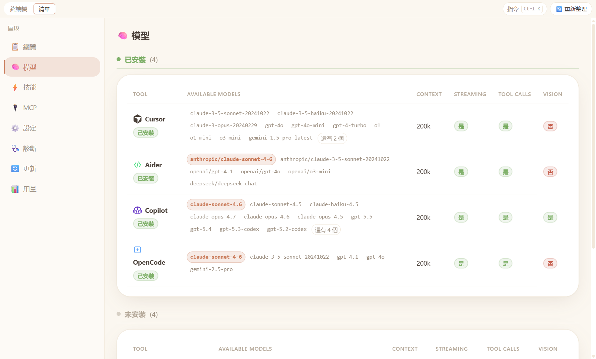
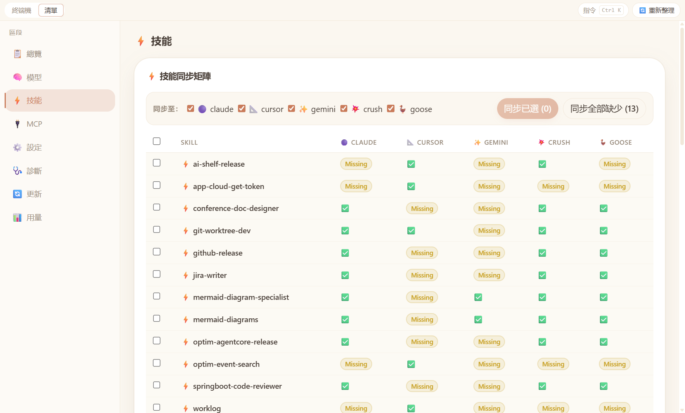
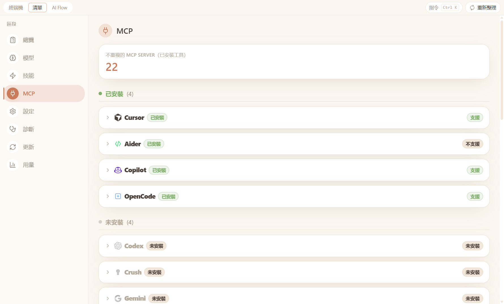
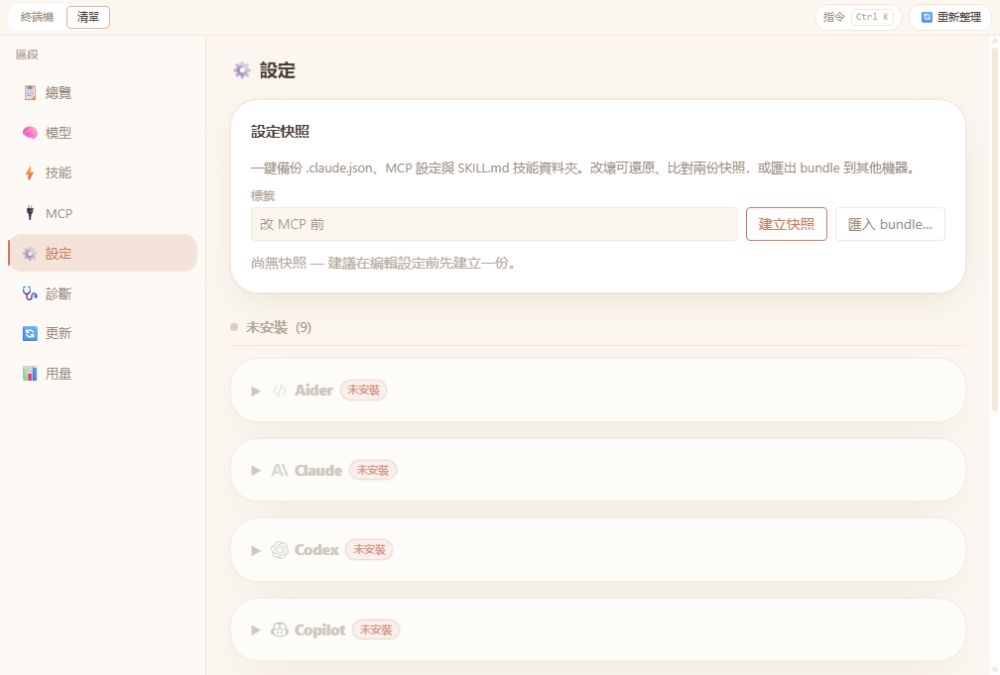
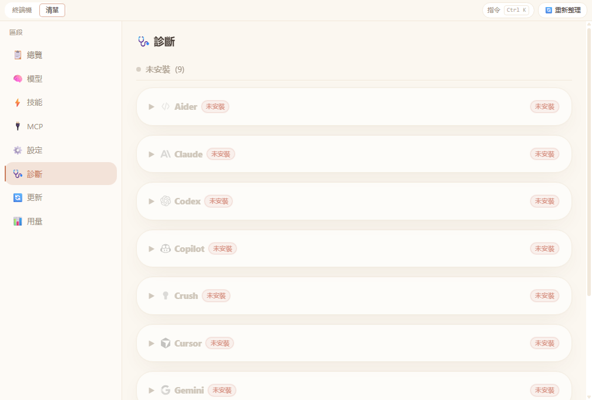

# UI Pages — Detailed Guide

> Full page-by-page walkthrough of the AI Shelf desktop app.  
> Back to [README](../README.md) · [中文說明](../README.zh-TW.md) · [繁體中文頁面說明](pages.zh-TW.md)

---

## Table of Contents

- [App navigation](#app-navigation)
1. [Overview](#1-overview)
2. [Terminal](#2-terminal)
3. [Models](#3-models)
4. [Skills](#4-skills)
5. [MCP Servers](#5-mcp-servers)
6. [Config Files](#6-config-files)
7. [Doctor](#7-doctor)
8. [Update](#8-update)

---

## App Navigation

The desktop app has two top-level modes:

- **Terminal** (default): session launcher with profiles and split panes
- **Inventory**: tabbed dashboard (Overview, Models, Skills, MCP, Config, Doctor, Update)

Use the header tabs to switch modes at any time.

### Inventory footer

While **Inventory** mode is open, the window footer shows **🔄 Refresh** to re-run detection and reload all tabs.

---

## 1. Overview

The **Overview** tab is the inventory home screen. It summarizes every AI CLI the app knows about (installed or not). Some labels are localized; column headers stay in English.

### Summary Bar
Four stat cards run across the top:

| Card | Meaning |
|---|---|
| **已安裝 / 偵測總數** | Installed tool count vs. total tools scanned |
| **未安裝** | Tools detected but not available on `PATH` |
| **MCP Servers** | Unique MCP servers reported by **installed** tools |
| **Warnings** | Rows that are not installed or are installed but missing auth |

### Capability Table
The main table lists one row per tool with the following columns:

| Column | Description |
|---|---|
| **Tool** | Tool name with official logo |
| **Version** | Installed version (from `--version`) |
| **Auth** | Auth status: `ok` · `missing` · `expired` · `unknown` |
| **MCP** | Whether MCP is configured (`yes` / `no`) |
| **Model** | Active default model |
| **Context** | Maximum context window (e.g. `200k`) |
| **Stream** | Supports streaming output (`yes` / `no`) |
| **Tools** | Supports tool/function calling (`yes` / `no`) |
| **Skills** | Comma-separated list of detected skills |

### Warnings Panel
Lists any actionable issues (e.g. *"Copilot binary not found in PATH"*) with tool name and a short description.

### Environment Variables Panel
Shows which AI-related environment variables (`ANTHROPIC_API_KEY`, `OPENAI_API_KEY`, `GITHUB_TOKEN`, etc.) are **present** or **missing** in the current shell environment, without revealing their values.

---

## 2. Terminal

**Terminal** mode is the profile-based workspace: SQLite-backed profiles, multi-pane **node-pty** sessions, optional external launches, and a dedicated **Terminal Settings** window.

### Profiles sidebar

- Create, rename, delete, and reorder profiles
- Per-profile **Profile 設定** (gear icon): display name, **default folder** (with folder picker), **default tool**, **同步輸入至所有 terminal** (broadcast typing to every pane), and accent color
- Choose **Settings** at the bottom of the sidebar to open the **Terminal Settings** window (see below)

### Terminal Settings window

Opened via **Settings** in the profiles sidebar (window title **Terminal Settings**). It hosts the shared `ChatSettingsPanel`:

| Section | What it does |
|---|---|
| **Working directory** | Dropdown of `~ (home directory)` plus recent folders; **Browse…** adds a path; up to **10** folders are remembered; **Clear history** resets the list |
| **External terminal preference** | Same choices as the in-app selector, shown as pill buttons |
| **Terminal background** | Presets: Windows Terminal black, App theme, Pure black, PowerShell blue, VS Code; optional custom hex color |

### Toolbar (active profile)

| Control | Description |
|---|---|
| **+ Pane** | Opens a menu of detected tools; adds another embedded terminal up to the profile limit (`current/max` in the profile chip) |
| **External terminal `<select>`** | Same mapping as **External terminal preference** (Auto detect, Windows Terminal, PowerShell 7+, PowerShell 5, Command Prompt) |
| **`· sync` badge** | When **broadcast input** is enabled and more than one pane exists, the profile chip shows `· sync` next to the pane counter |

### Agent grid

The **可用的 Agent** section lists installed tools. Each card shows version, auth state, a short blurb, and:

- **🖥️ External** — spawn the tool in the configured external terminal
- **⌨️ In-App** — spawn an embedded **xterm.js** pane via **node-pty**

### Embedded terminal panes

- Split tree with draggable dividers; resize and reflow as needed
- Focused pane receives keyboard input; with **broadcast input** on, keystrokes go to **all** panes
- Restoring a profile replays the saved layout and sessions when possible

### Pane keyboard shortcuts (Terminal mode, when panes are open)

Ignored while typing in inputs (e.g. profile rename).

| Shortcut | Action |
|---|---|
| **Ctrl+Tab** (default) | Next pane — customizable in **Settings → Pane shortcuts** |
| **Ctrl+Shift+Tab** (default) | Previous pane — customizable in Settings |
| **Ctrl+1 … Ctrl+9** (default) | Focus pane N (tree order) — modifier customizable in Settings |
| **Ctrl+W** | Close focused pane |
| **Ctrl+\\** (default) | Split right (horizontal) — customizable in Settings |
| **Ctrl+Shift+\\** (default) | Split down (vertical) — customizable in Settings |

---

## 3. Models

The **Models** tab is a read-only matrix of detected defaults, optional expanded model lists, and capability flags. The header may show **loading models…** while enrichment finishes.

### Sections

- **已安裝** — tools that are on `PATH`
- **未安裝** — tools that are known but missing; shows install hints when available

### Model table

| Column | Description |
|---|---|
| **Tool** | Tool name and logo |
| **Available Models** | Chips for the active default plus any extra ids returned during inventory enrichment; falls back to `default` when no list exists |
| **Context** | Formatter output for configured context/token limits |
| **Streaming / Tool Calls / Vision** | Capability switches (`Yes` / `No`) from inventory |

### Long lists

When more than **10** model chips exist, **`+N more`** expands inline; **Show less** collapses again. Expansion state is tracked per tool.

### Where the data comes from

Inventory merges quick detection with optional enrichment (for example **Cursor** model ids via **`agent --list-models`**). Providers may also hydrate lists from authenticated HTTP APIs when environment keys are present, so catalogs can update without embedding static CLI output in this doc.

---

## 4. Skills

The **Skills** tab shows which capabilities each tool supports.

### Per-Tool Skill Cards
Each tool gets a card with:
- Tool logo and name
- A **count badge** showing how many skills were detected
- **Skill tags** — e.g. `coding`, `bash`, `file-edit`, `mcp`, `shell`, `repo-edit`

### Skill Matrix
A cross-tool matrix at the bottom of the page shows every detected skill as a row and each tool as a column. A ✓ badge indicates the tool supports that skill, making it easy to compare capabilities across tools.

---

## 5. MCP Servers

The **MCP** tab gives a complete picture of your Model Context Protocol server setup.

### Summary Header
When MCP data exists, the summary tile shows **Unique MCP Servers（已安裝工具）** — unique server names aggregated from **installed** tools only.

### Per-Tool Cards
Each card shows:

- Tool header with **Supported**, **Not Supported**, or an install-state badge depending on detection
- When a CLI is missing, the UI shows *「未安裝，無法掃描 MCP 設定」*
- Configured MCP server tags (🔌 prefixed) plus monospace paths you can click to reveal in Explorer

### MCP Server Matrix
A full matrix at the bottom where:
- **Rows** = individual MCP servers
- **Columns** = tools
- A green ✓ badge indicates the server is configured for that tool

### MCP Sync
The matrix card includes tooling to copy entries between JSON MCP configs:

- **Sync to:** checkboxes choose which inventory tools (`claude`, `copilot`, `cursor`, `gemini`, `opencode`) receive writes
- **Sync Selected (`n`)** applies only servers ticked in the first column (use the header checkbox to select every “missing” row)
- **Sync All Missing (`n`)** applies every server row that still has gaps
- While work is in-flight the buttons read **Syncing…**; summaries list `added`, `skipped`, or errors per tool when finished
- Rows with every target already configured are dimmed; the footer counts **servers total**, **need sync**, and **fully synced**

### Matrix footer strip
Inside the MCP matrix card, a compact line reports **servers total**, how many **need sync**, and how many are **fully synced** (mirrors the sync panel state).

---

## 6. Config Files

The **Config** tab lists every configuration file used by each tool, grouped by type.

### File Types

| Type | Description |
|---|---|
| **Config** | Main JSON/YAML config files (e.g. `settings.json`, `.claude.json`) |
| **Instructions** | Instruction/system-prompt files (e.g. `CLAUDE.md`, `instructions.md`) |
| **MCP** | MCP-specific config files (e.g. `mcp.json`, `mcp-config.json`) |

### File Rows
Each row shows:
- A file-type badge
- The full resolved path in monospace style
- A **click-to-open** action that opens the file in the system's default editor

---

## 7. Doctor

The **Doctor** tab runs health checks to surface problems with your AI CLI setup.

### Parallel Execution
All tool cards are **rendered immediately** when the tab loads, each showing a spinning loader. Checks for every tool run **concurrently** — results appear card by card as each check completes, rather than waiting for all checks to finish.

### Checks Performed
Each tool card runs the following checks:

| Check | What it verifies |
|---|---|
| **Binary** | Tool binary exists and is executable in `PATH` |
| **Auth** | Authentication status (`ok` / `missing` / `expired` / `unknown`) |
| **Config JSON** | Main config file is valid JSON (if present) |
| **MCP Config JSON** | MCP config file is valid JSON (if present) |

### Result Indicators
- ✅ **Pass** — check succeeded
- ⚠️ **Warning** — present but not ideal (e.g. unknown auth state)
- ❌ **Fail** — critical issue requiring action

---

## 8. Update

The **Update** tab checks for and applies updates to your AI tools and the inventory tool itself.

### How Updates Work
The desktop UI ultimately runs `node dist/cli.js update <tool>` (`ai update …`) underneath. The command line printed on each card comes from [`src/tools.ts`](../src/tools.ts) (`TOOL_UPDATE`) plus a package-manager-specific self-update suggestion.

| Target | Printed command (`<cmd> <args…>`) |
|---|---|
| Claude Code | `claude update` |
| GitHub Copilot CLI | `copilot update` |
| Cursor | `agent update` |
| OpenAI Codex | `codex upgrade` |
| Google Gemini CLI | `gemini update` |
| Aider | `pip install -U aider-chat` |
| OpenCode | `opencode upgrade` |
| AI Shelf (**self** / **desktop**) | **Installed NSIS app**: GitHub Release check on startup; in-app download with progress and restart to install (**Download & upgrade desktop** on the Update tab). **From source / dev**: `pnpm` / `yarn` / `npm` global update command as detected |

Packaged CLIs use npm registry metadata (`TOOL_NPM_PACKAGE`). The installed desktop app uses `electron-updater` and `latest.yml` on GitHub Releases.

### Per-Tool Cards
Each card shows:
- Tool logo and name
- Currently installed version
- Update status (up-to-date / update available)
- The exact update command being run

### Re-check All
The **Re-check All** button at the top re-runs the version scan for all tools without applying any updates, useful for refreshing the status after a manual update.

---

## Notes

- Screenshot order and filenames are generated by `tests/e2e/screenshot.spec.ts`.
- If tab labels or order change, update this document (`pages.md`, `pages.zh-TW.md`) and screenshot tests together to keep docs and automation aligned.
